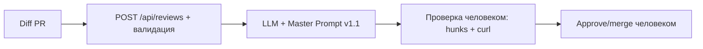

# ADR: решение для первого рабочего сценария

- Статус: proposed
- Дата: 2026-09-19
- Ответственные: студент (ревьюер), рабочий агент OpenCode Build

## Контекст

Zero-shot (P1-01) находит реальные падения (`payload["diff"]` → 500, инжекция через вклейку diff), но возвращает 9 недоказуемых советов без строк и проверок. Нужен помощник, дающий max 3 риска с файлом/строкой-hunk/цитатой/curl-проверкой, без права approve/merge.

## Решение

Принять Master Prompt v1.1: вход — только diff; выход — описание + max 3 риска (файл + строка строго из hunk-заголовков + цитата + воспроизводимая проверка со статусом) + проверки + вопросы; запрещены approve/merge/правка кода и выдумки как факты. Pydantic-валидация `diff` (422 вместо 500) и маппинг ошибок LLM — следующим инкрементом.

## Рассмотренные альтернативы

| Альтернатива | Почему не выбрали сейчас |
|---|---|
| Оставить zero-shot без инструкции | 9 советов, нет строк/проверок, выдумки (Python/async) — не дает метрику ≥80% |
| Расширенная схема ответа (findings/severity) | Требует договора о схеме; пока фиксируем текстовый формат с триадой, вопрос вынесен в P1-02 |

## Последствия и главный риск

- Положительные последствия: проверяемые риски за минуты; 0 шт 5xx на пустом теле после валидации; медиана ревью −20–30%.
- Ограничения: номера строк только из hunks; незапущенные проверки со статусом; сервис LLM может не ответить — ошибка мапится.
- Главный риск: модель выдумывает номера строк (факт P1-02: «36–37» при файле ~13 строк).
- Как проверим риск: сверка каждой строки с `@@ +c,d @@`; правило v1.1 + вопрос студенту перед merge.

## Архитектурная схема

## Как использовали AI

- Для чего: сравнение P1-01 vs P1-02 дало формулировки решения и главного риска (выдуманные строки).
- Тип промпта: master prompt + сравнение.
- Строка в [`prompts.md`](prompts.md): P1-02.
- Что проверил студент и какие исправления поручил агенту: утвердил статус proposed и 2 правила v1.1.
