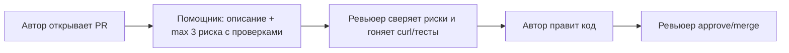

# Анализ процесса: AS IS и TO BE

## AS IS

Участники: автор PR → ревьюер (человек). Ручные операции: прочитать весь diff, найти риски без подсказок, написать комментарии, дождаться исправлений. Задержки: очередь на ревью, недоказуемые замечания («добавьте тесты») без файла/строки/проверки. Точки потери информации: устные договоренности, комментарии без привязки к строке, падения сервиса без логов (`KeyError` → 500 без понятного ответа).

## TO BE

Тот же процесс, но ревьюер сначала получает от AI-помощника (по Master Prompt v1): краткое описание + max 3 риска с файлом/строкой-hunk/цитатой/проверкой + список curl-проверок. Ревьюер сверяет 2–3 риска за минуты, запускает проверки, решение (approve/merge) принимает только человек. Помощник не меняет код.

## Разница

| Что меняется | AS IS | TO BE | Как проверим изменение |
|---|---|---|---|
| Вход ревью | Голый diff | Diff + структурированный ответ помощника | Чек-лист: ≥80% ответов с файлом+строкой+проверкой |
| Падения сервиса | `KeyError` → 500 на `{}` | Валидация, корректный 422 | `curl POST /api/reviews -d '{}'` → 422, 0 шт 5xx |
| Скорость | Долгое первое ревью | Медиана первого ревью −20–30% | Замер timestamps PR до/после |

## Как использовали AI

- Для чего: zero-shot разбор diff показал шум (9 советов) — отсюда TO BE с лимитом max 3 и обязательной проверкой.
- Тип промпта: zero-shot baseline + master prompt.
- Строка в [`prompts.md`](prompts.md): P1-01, P1-02.
- Что проверил студент и какие исправления поручил агенту: утвердил AS IS/TO BE и правило «строки строго из hunks»; поручил связать разницу с 3 метриками.
