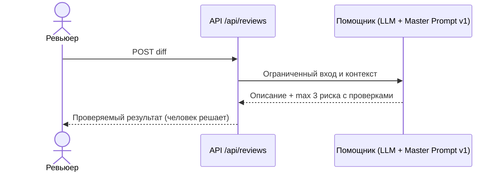

# Use cases и user stories

## Первый рабочий сценарий

**Когда** ревьюер открывает PR, **система** (помощник по Master Prompt v1) возвращает краткое описание + до 3 рисков с доказательством и проверками, **а пользователь получает** проверяемый за минуты список вместо шумных советов.

Не входит в этот сценарий:

- approve/merge от AI;
- изменение кода помощником;
- авторизация, async-переписывание, лимиты как готовые требования (пока вопросы).

## Use case

| Поле | Значение |
|---|---|
| Актор | Ревьюер PR |
| Триггер | Открыт/обновлен PR, нужен первый проход |
| Предусловия | Есть текст diff; помощник запущен с Master Prompt v1 |
| Основной результат | Описание + 1–3 риска (файл + строка-hunk + цитата + curl-проверка) + список проверок |
| Ошибка или отказ | Пустой/битый diff → понятный 422, а не 500; сбой LLM → понятная ошибка, а не молчание |



## User stories и acceptance criteria

```gherkin
Feature: Доказуемое ревью от помощника

  Scenario: Позитивный
    Given валидный diff PR
    When ревьюер запрашивает ревью с Master Prompt v1
    Then ответ содержит описание, 1-3 риска с файлом+строкой-hunk+цитатой+проверкой и список проверок

  Scenario: Негативный или граничный
    Given пустое тело запроса {}
    When ревьюер отправляет POST /api/reviews
    Then сервис отвечает 422 с понятным сообщением, а не 500/KeyError
```

## Как использовали AI

- Для чего: примеры хорошего/плохого комментария из Context Pack легли в acceptance criteria.
- Тип промпта: master prompt.
- Строка в [`prompts.md`](prompts.md): P1-02.
- Что проверил студент и какие исправления поручил агенту: утвердил границы (без approve/merge) и негативный сценарий с 422.
