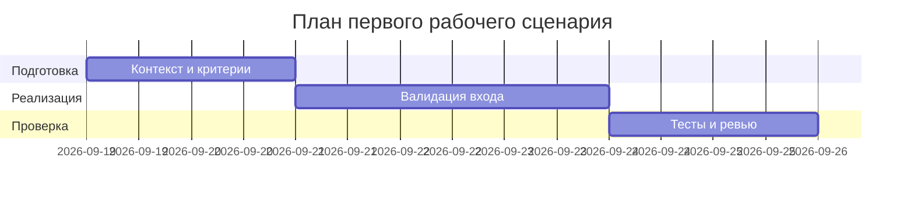

# План поставки

## Инкременты и ответственность

| Инкремент | Наблюдаемый результат | Что делает человек | Что делает AI или субагент | Проверка | Зависимости |
|---|---|---|---|---|---|
| 1 | Контекст + master prompt + P1-01/P1-02 и сравнение | Утверждает пользователя, метрики, оценку и вывод | Готовит `context/problem/prompts.md`, гоняет изолированные `opencode run` | `make step1` OK, `results/p1-*.md` на месте | `TRAINING_PR.diff`, модель `vsellm/openai/gpt-5` |
| 2 | Надежный вход: валидация `diff`, 422 вместо 500, маппинг ошибок LLM | Ревьюит diff фикса, решает о merge | Предлагает риски/тесты по Master Prompt v1.1, код не меняет | `curl -d '{}'` → 422; unit/integration зеленые | Инкремент 1 |
| 3 | Проверяемый выход: max 3 риска с hunks и curl, доки и E2E | Прогоняет E2E, принимает PR | Готовит `analysis/adr/tests_*`, сверяет цитаты с hunks | E2E по таблице, метрика ≥80% доказуемых ответов | Инкременты 1–2 |

## Диаграмма Ганта

## Как использовали AI

- Для чего: структура инкрементов выведена из P1-01/P1-02 (сначала контекст и формат, потом надежность входа, потом выход).
- Тип промпта: master prompt.
- Строка в [`prompts.md`](prompts.md): P1-02.
- Что проверил студент и какие исправления поручил агенту: утвердил 3 инкремента и разделение «человек решает, AI предлагает».
